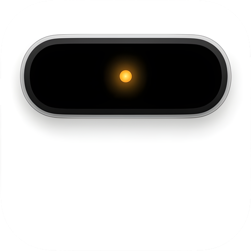

# Beacon

<p align="center">
  
</p>

**Beacon** is an open-source **macOS menu-bar AI assistant** with a floating Dynamic Island–style pill. Type or dictate; optionally let the model use **Mac tools** (files, terminal, Finder, clipboard, AppleScript) behind explicit permission dialogs.

> Bienvenido — Beacon es un asistente de IA en la barra de menú de macOS con una isla flotante tipo Dynamic Island. Claves API solo en Ajustes / Keychain; nunca en el repo.

Created by **[Hector Ypz](https://github.com/H3ctorYpz)**. Licensed under **[MIT](LICENSE.md)**.

Contributions welcome — fork, improve, and open a **pull request**. See [CONTRIBUTING.md](CONTRIBUTING.md).

## Features

- Floating island (expand on hover or `⌘⇧B`)
- Hide / show pill (`⌘⇧H` → opacity 0; hover the same spot to restore)
- Multi-account AI: OpenAI-compatible, Anthropic, **Google Gemini** (native), Ollama / LM Studio, and presets
- Voice dictation (Apple Speech) with language picker
- Agent tools with Allow / Allow for session / Deny
- Settings window that works with `LSUIElement` menu-bar apps
- API keys in Keychain (no telemetry)

## How it works

High-level architecture:

```text
┌─────────────────────────────────────────────────────────────┐
│  StatusItemController (menu bar)                            │
│    ↕ toggle / settings                                      │
│  IslandPanelController → FloatingIslandHost (SwiftUI pill)  │
│    ↕ messages / dictation                                   │
│  ConversationStore                                          │
│    → AIRouter → OpenAI-compat / Anthropic / Gemini clients  │
│    → AgentOrchestrator → AgentPermissionGate → AgentExecutor│
│  AIAccountStore + KeychainStore (accounts & secrets)        │
│  AppPreferences + SettingsWindowController                  │
└─────────────────────────────────────────────────────────────┘
```

1. **UI** — An `NSPanel` hosts the island; expand/collapse animates in SwiftUI without resizing the panel.
2. **Chat** — `ConversationStore` builds prompts and routes through the active account in `AIAccountStore`.
3. **Providers** — `AIRouter` picks OpenAI-compatible, Anthropic, or Gemini HTTP clients.
4. **Agent** — When Mac tools are enabled, the model may request tools; sensitive actions show a permission dialog first.
5. **Speech** — `SpeechDictationController` uses Apple Speech and fills the composer.

## Screenshots / icon

App icon (committed under `docs/` and `Beacon/Assets.xcassets/AppIcon.appiconset/`):


## Requirements

- **macOS 26+** (deployment target in the Xcode project; lower it locally if needed)
- **Xcode 16+** recommended
- An API key from a supported provider **or** a local OpenAI-compatible server (Ollama, LM Studio)

> Chat subscriptions (ChatGPT Plus, Claude Pro, Gemini Advanced, etc.) are **not** API access. Use console API keys only.

## Build & run

```bash
git clone https://github.com/H3ctorYpz/Beacon.git
cd Beacon
xcodebuild -project Beacon.xcodeproj -scheme Beacon -configuration Release \
  -derivedDataPath DerivedData build
open DerivedData/Build/Products/Release/Beacon.app
```

Or open `Beacon.xcodeproj` in Xcode → Run.

### First run / configuration

1. Menu bar icon → **Settings…** (`⌘,`)
2. **AI** → add or edit a provider (e.g. Google Gemini) → paste API key → Test → Save
3. Expand the island (`⌘⇧B` or hover) and ask

**Never commit API keys.** Keys belong in Settings / Keychain only. See [SECURITY.md](SECURITY.md).

### Ollama

```bash
ollama pull llama3.2
ollama serve
```

Settings → AI → add **Ollama (local)** (`http://127.0.0.1:11434/v1`).

## Shortcuts

| Shortcut | Action |
|----------|--------|
| `⌘⇧B` | Expand / collapse island |
| `⌘⇧H` | Pill opacity 0 / restore |
| `⌘,` | Settings |

## Project layout

```text
Beacon/
  App/          Menu bar, AppDelegate
  UI/           Island panel, Siri-style bubble
  AI/           Accounts, router, conversation
  Agent/        Tools + permissions + orchestrator
  Settings/     Settings window
  Support/      Preferences, Keychain, speech
docs/
  icon.png      README / GitHub preview icon
```

## Contributing

1. Fork the repo  
2. Branch from `main`  
3. Open a pull request  

Full guide: [CONTRIBUTING.md](CONTRIBUTING.md). Security: [SECURITY.md](SECURITY.md).

## Privacy

- No built-in telemetry
- Session chat stays in memory
- Keys leave the device only toward the API endpoint you configured
- Agent actions that change the Mac require your approval (except a few read-only tools)

## License

[MIT](LICENSE.md) © 2026 Hector Ypz

Island UI inspired by Kavsoft **SiriBubble** (Balaji Venkatesh), ported and extended for macOS AI use. Not affiliated with Apple, Google, OpenAI, or Anthropic.
